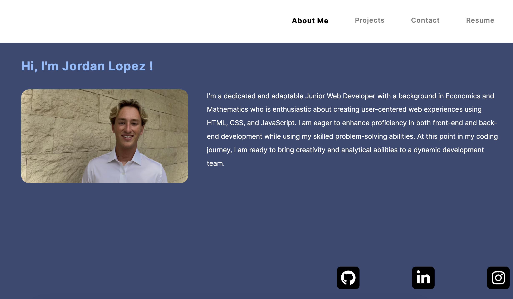

# React Portfolio Website

Link to the deployed app: https://friendly-belekoy-035086.netlify.app

## Description
This is my first project using React! With this site, you can learn about who I am, my skills, projects, and even contact me! (doesn't currently work)
 
For this site, I used `React Browser Router` to control the url endpoints and React Hooks like `UseEffect` and `UseState` for added functionality.

## Installation
To install on your own machine, simply clone down my repo, run `npm install` at the root directory, then run `npm start` in order to start the client server!

## License
This application is covered under the MIT license.

## Questions
For questions about the project, you can reach me via:
- GitHub: [Lopez-Jordan](https://github.com/Lopez-Jordan)
- Email: jordanlopezemail@gmail.com
    